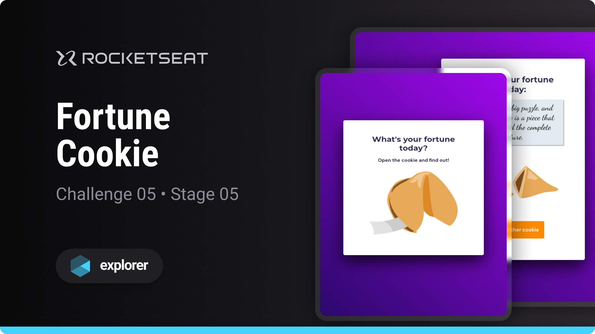

# Fortune Cookie

Challenge developed on Rocketseat's Explorer course

**Fortune Cookie is a game designed to put into practice the basic JavaScript programming concepts**

## 🔗 Project Links

- 🚀 [**Deploy**](https://emanueltavecia.github.io/fortune-cookie)
- 🎨 [**Figma**](https://www.figma.com/community/file/1182751789348533739)

## 📋 Project information

- Rocketseat Explorer
- Stage 05
- Challenge 05

## 🧠 Concepts learned

The development of this challenge aims to put the following concepts into practice:

- DOM Manipulation
- Events and Interactivity
- arrays
- functions

## 💻 Technologies

## 📄 License

This project is licensed under the MIT License - see the [LICENSE](./LICENSE) file for more details.
